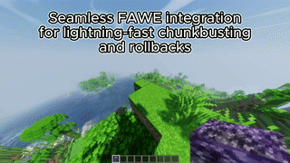

# Seys Chunkbuster

**Seys Chunkbuster** is a powerful, configurable, and performance-friendly plugin that allows server administrators to define and manage custom chunkbusters — tools that perform configurable block-breaking operations across chunks or defined areas. This plugin supports Minecraft 1.14 through 1.21, with optional FastAsyncWorldEdit (FAWE) integration for optimal performance and rollback functionality.

---

## Features

- Supports Minecraft **1.14 to 1.21**
- Optional **FAWE integration** for high-performance editing
- Fully **configurable chunkbuster definitions** (material, radius, shape, blacklist, drop behavior, etc.)
- Multiple **break behaviors**: clear blocks, drop raw/silk items, give items to player
- Per-buster **cooldown configuration**
- Optional **global or per-buster cooldown** logic
- **Permission-based usage** (per type or wildcard)
- **Confirmation GUI** before activation (optional per buster)
- **Rollback support** (FAWE only)
- Optional **fill material** (e.g., replace air with water, lava, etc.)
- Clean and efficient implementation, built for extensibility

---




## Getting Started

### Installation

1. Download the plugin `.jar` file.
2. Place it in your server’s `plugins/` directory.
3. (Optional) Install [FAWE](https://www.spigotmc.org/resources/fast-async-worldedit.13932/) for better performance.
4. Start your server to generate the default configuration files.

---

## Commands

| Command                                 | Description |
|----------------------------------------|-------------|
| `/chunkbuster give <player> <type> [amount]`   | Give a chunkbuster item to a player |
| `/chunkbuster setitem <type>`          | Set the visual item for a chunkbuster based on held item |
| `/chunkbuster addchunkbuster <name>`   | Create a new chunkbuster based on held item |
| `/chunkbuster reload`                  | Reload configuration and chunkbuster definitions |
| `/chunkbuster rollback [player]`       | Undo the last chunkbuster operation (FAWE only) |

---

## Permissions

| Permission                              | Description |
|-----------------------------------------|-------------|
| `seyschunkbuster.use.*`                 | Use all chunkbusters |
| `seyschunkbuster.use.<type>`            | Use a specific chunkbuster type |
| `seyschunkbuster.bypasscooldown`        | Bypass cooldown restrictions |
| `seyschunkbuster.rollback`              | Use the rollback command on self |
| `seyschunkbuster.rollback.others`       | Use the rollback command on other players |

---

## Configuration

### `config.yml`

```yaml
use-fawe-if-available: true
max-rollbacks-per-player: 3

disabledworlds:
  - hub
  - creative

invertworldcheck: false
global-cooldown: false
```

---

## Defining Chunkbusters

Chunkbusters are defined in `chunkbusters.yml`. Each key is a unique type ID.

### Example

```yaml
diamondbuster:
  material: DIAMOND_BLOCK
  title: "&bDiamond Buster"
  lore:
    - "&7Breaks everything except bedrock"
  radius: -1
  shape: SQUARE
  blacklist:
    - BEDROCK
  invertblacklist: false
  bottomlayeroffset: 0
  require_confirmation: true
  sound_on_bust: ENTITY_GENERIC_EXPLODE
  particle_on_bust: EXPLOSION_LARGE
  cooldown: 60
  placement_behavior: BREAK
  break_behavior: GIVESILKITEM
  vertical_behavior: FULLCHUNK
  fill_material: AIR
```

---

## FAWE Support

If FAWE is present and enabled in `config.yml`, chunkbusting operations are handled via FAWE for speed and rollback support. Otherwise, safe Bukkit operations are used.

---

## Use Case Ideas

- **Ore Extractor**: Only breaks ores, gives drops to player.
- **Water Filler**: Fills air with water using `fill_material: WATER`.
- **Chunk Wiper**: Clears everything except bedrock.
- **Admin Tool**: Fast removal of chunks for moderation.

---

## Compatibility

- Minecraft **1.14 – 1.21**
- Works with or without FAWE
- Requires Paper or Spigot API

---

## License

MIT License — see [LICENSE](LICENSE).

---

## Author

**Seyloj** — Minecraft plugin developer focused on clean, modern, and powerful server tools.
